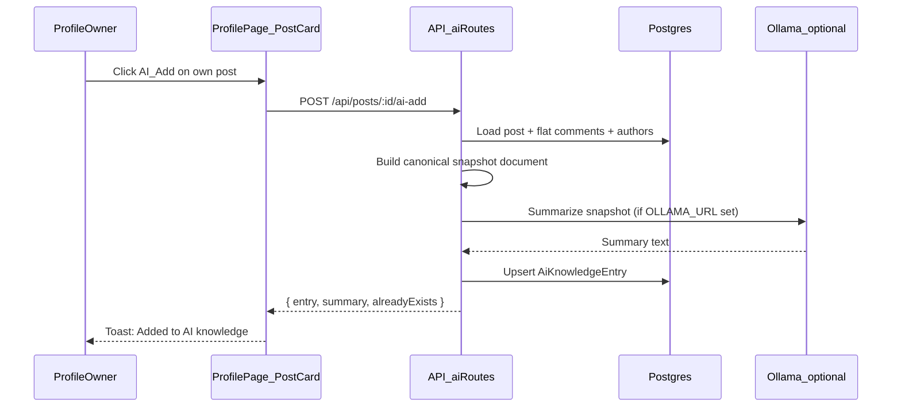
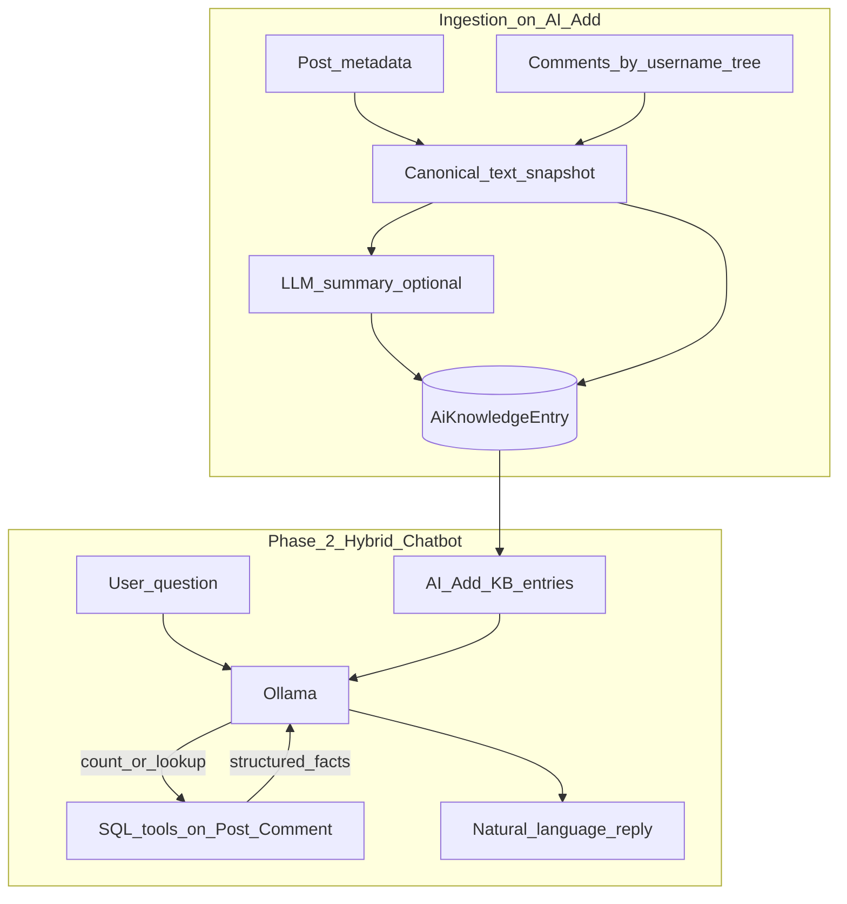
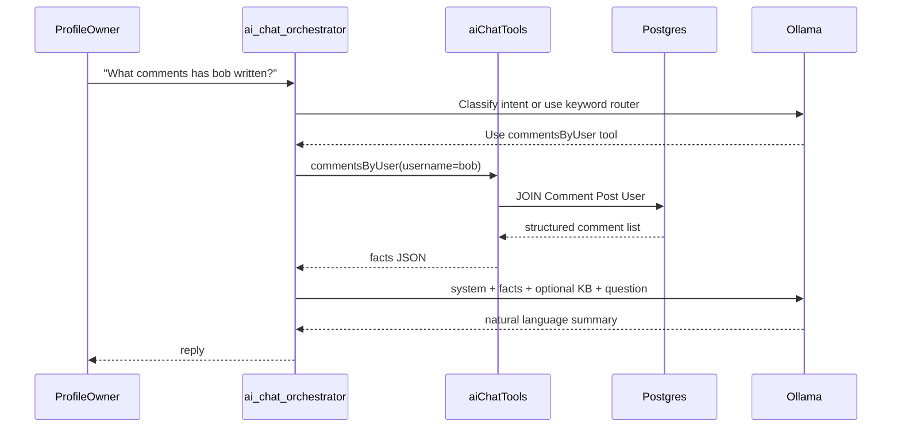

# AI Add + Profile Chatbot Architecture

**Status:** Planned — not implemented. See [README.md](README.md) for doc index and suggested build order.

Design doc for curating post + comment threads into a profile-scoped AI knowledge base, with a **hybrid profile chatbot**: curated KB for deep thread synthesis + SQL-backed tools for factual cross-post queries.

**Related:** [FRIEND_SELECT_CHAT.md](FRIEND_SELECT_CHAT.md) (same hybrid LLM + tools pattern, separate feature).
## Goals

- **AI Add**: Profile owner clicks on a post on **their own wall** → ingest post + all comments (attributed by `@username`) into a **profile knowledge base**.
- **Early scale**: A few posts, a few comments → no vector DB, no embeddings, no paid API required.
- **Later**: Profile **chatbot mode** answers:
  - **Semantic** questions from AI Added threads (e.g. "users liked X and Y but many had issues with Z")
  - **Factual** questions across your whole wall via structured tools (e.g. "what comments has @bob written on all my posts?", "how many VIDEO_LINK posts do I have?")

## Constraints

| Decision | Choice |
|---|---|
| LLM cost | Cheapest possible — local Ollama first; small context stuffing beats RAG |
| Dataset size | Minimal (early days) |
| Who can AI Add | **Post author only**, on **own profile page** |
| Chatbot query scope | **Hybrid** — KB for synthesis + SQL tools for counts / cross-post lookup |

"Author only" means the logged-in user must be `post.authorId` **and** `post.profileOwnerId` (your post on your wall). A friend commenting on your wall does not get AI Add on that post unless they authored it elsewhere.

---

## High-level flow





---

## Data model (Postgres)

Add to `packages/db/prisma/schema.prisma`:

```prisma
model AiKnowledgeEntry {
  id              String   @id @default(uuid())
  profileOwnerId  String   // whose knowledge base (always post author in v1)
  postId          String   @unique // one KB entry per post; re-click = refresh
  addedByUserId   String   // same as profileOwnerId in v1
  postType        PostType
  sourceUrl       String?  // videoUrl for VIDEO_LINK
  linkTitle       String?
  linkDescription String?
  postText        String?
  /// Flattened thread: "@alice: ..." with indent markers
  commentsSnapshot String
  /// Full structured JSON for future re-processing
  rawJson         Json
  /// LLM-generated synthesis; null if LLM unavailable
  summary         String?
  summaryModel    String?
  createdAt       DateTime @default(now())
  updatedAt       DateTime @updatedAt

  profileOwner User @relation(...)
  post         Post @relation(...)
}
```

**Why this shape**

- **`commentsSnapshot`**: Human-readable text fed to the LLM and shown in a "Knowledge" admin panel.
- **`rawJson`**: Structured `{ post, comments: CommentTree[] }` so you can re-summarize when the model changes.
- **`postId @unique`**: Re-clicking **AI Add** refreshes the snapshot (new comments picked up).
- No embedding table — with ~5 entries × ~50 comments, total context stays under ~20k tokens.

Optional Phase 2 table `AiChatMessage` (profileOwnerId, role, content, createdAt) for chat history — not needed for MVP ingest.

---

## Canonical snapshot format

Built server-side in `apps/api/src/services/aiKnowledge.ts`, reusing the same tree logic as `buildCommentTree` in `apps/web/src/pages/ProfilePage.tsx` (extract shared util or duplicate minimally in API).

Example output stored in `commentsSnapshot`:

```
POST (VIDEO_LINK)
URL: https://example.com/review
Title: Example Product Review
Author note: Check this out

COMMENTS:
@bob: Loved X and Y
  @carol (reply): Agreed on X, but Z was broken
@dave: A and B were great; C felt cheap
@author (you): I agree with X, Z, and B
```

Summary prompt (when LLM available):

> Summarize comment sentiment by username. Note agreements/disagreements with the post author. Be concise; use plain language like: "Users report liking X and Y but many have issues with Z..."

---

## LLM layer (cheapest path)

New `apps/api/src/services/llmClient.ts`:

| Priority | Provider | Cost | When |
|---|---|---|---|
| 1 | **Ollama** (`OLLAMA_URL`, `OLLAMA_MODEL=llama3.2:3b`) | Free on VPS | Default if env set |
| 2 | **No LLM** | Free | Store snapshot only; `summary = null`; chatbot uses raw snapshot |
| 3 | Optional later | Paid | `OPENAI_COMPAT_URL` + tiny model if Ollama not on VPS |

For minimal KB size, **full-context stuffing** beats RAG for curated entries:

```typescript
const kbContext = entries.map(e => e.summary ?? e.commentsSnapshot).join("\n---\n");
```

Cross-post factual queries use **SQL tools**, not the KB alone (see Hybrid chatbot below).

Add to `.env.example`:

```
# Optional — free local LLM (Ollama on VPS or dev machine)
OLLAMA_URL=http://127.0.0.1:11434
OLLAMA_MODEL=llama3.2:3b
```

---

## API routes

New router `apps/api/src/routes/aiKnowledge.ts`, mounted in `apps/api/src/app.ts`:

| Method | Path | Auth | Behavior |
|---|---|---|---|
| `POST` | `/api/posts/:postId/ai-add` | Session | Ingest/refresh entry |
| `GET` | `/api/me/ai-knowledge` | Session | List owner's KB entries |
| `DELETE` | `/api/me/ai-knowledge/:entryId` | Session | Remove from KB |
| `POST` | `/api/me/ai-chat` | Session | **Phase 2** — hybrid chat (KB + tools) |

**`POST /api/posts/:postId/ai-add` guards**

1. `req.session.userId === post.authorId`
2. `post.profileOwnerId === post.authorId` (own wall only)
3. Load all comments via existing comment query pattern from `apps/api/src/routes/comments.ts`
4. Upsert `AiKnowledgeEntry`
5. Call LLM summarize async or inline (inline OK at this scale)

Return: `{ entry: { id, postId, summary, updatedAt }, refreshed: boolean }`

---

## Web UI

### Phase 1 — AI Add button

In `PostCard` (`apps/web/src/pages/ProfilePage.tsx`) action row (near Comment / Share):

- New prop: `canAiAdd: boolean` (= `profile.meta.isSelf && post.authorId === me.id`)
- Button: **AI Add** (ghost/secondary)
- On click: `POST /api/posts/:id/ai-add`
- States: idle → loading → "Added" (or "Updated" on refresh)
- Optional badge if post already in KB (from `_count` or lightweight `GET` list cached on profile load)

### Phase 1b — Knowledge panel (small)

On own profile, collapsible section **AI Knowledge** (below composer or in sidebar):

- Lists ingested posts (link title / first line / summary snippet)
- Remove button per entry
- Shows `summary` when present, else "Snapshot stored (no LLM summary)"

### Phase 2 — Hybrid chatbot mode

- Toggle **Chat with my page** on own profile
- Simple chat UI (messages + input)
- `POST /api/me/ai-chat` with `{ message }`
- **Two data sources:**
  1. **AI Add KB** — curated snapshots/summaries for deep thread questions
  2. **SQL tools** — live queries on `Post` + `Comment` for your whole wall

Reuse existing **Glowbyte** AI friend concept (`apps/api/src/services/aiFriend.ts`) only as UX inspiration — this KB is **your curated posts**, not the Glowbyte seed account.

---

## Who does what (NLP vs deterministic)

| Step | Who | Example |
|---|---|---|
| Format post + comments as text | **API** (`aiKnowledge.ts`) | `@bob: Loved X and Y` |
| Summarize on AI Add | **Ollama** | "Users liked X and Y…" |
| Count posts / filter by type | **API + Postgres** (tool) | `countPosts({ type: VIDEO_LINK })` |
| Comments by @username across wall | **API + Postgres** (tool) | `commentsByUser({ username: "bob" })` |
| Natural-language answer | **Ollama** | Combines tool results + KB context |

No separate NLP library. The LLM handles language; the API handles facts.

---

## Hybrid chatbot — tools + LLM

New service `apps/api/src/services/aiChatTools.ts` exposes **deterministic** functions the chat orchestrator can call before/alongside the LLM:

| Tool | SQL-ish behavior | Example question |
|---|---|---|
| `countPosts` | `Post` where `profileOwnerId = me`, optional `type` filter | "How many video links have I posted?" |
| `commentsByUser` | All `Comment` on your wall posts where `author.username = X` | "What kind of comments has @bob written?" |
| `postsWithCommentsByUser` | Posts on your wall that @bob commented on | "Which of my posts did bob engage with?" |
| `kbSummaries` | Load `AiKnowledgeEntry` for curated synthesis | "Summarize sentiment on the review I added" |

**Likes** ("how many videos did bob *like*?") require a future `Like` model — tool stub returns "likes not available yet" until shipped.

### Chat flow



**Intent routing (cheap):** For early scale, use simple keyword/heuristic routing (`how many`, `@bob`, `across all`) to pick tools. Full LLM tool-calling can come later when Ollama supports it reliably.

### Example query fit

| Question | Primary source |
|---|---|
| "What did people think of Z on my review post?" | **KB** (if AI Added) or tool + LLM over raw comments on that post |
| "What kind of comments has @bob written across all my posts?" | **`commentsByUser` tool** + LLM synthesis |
| "How many VIDEO_LINK posts do I have?" | **`countPosts` tool** (exact) |
| "How many videos did @bob like?" | **Blocked** until likes ship; say so clearly |

---

## Security and privacy

- KB entries are **private to profile owner** — never exposed to visitors in v1.
- Phase 2 chatbot on **own profile only** initially; exposing a public "Ask my page" bot is a later product decision.
- Comments ingested only from posts you authored — you already had wall access to read them.
- No sending data to cloud unless optional env is configured.

---

## Implementation phases

### Phase 1a (MVP — ship first)

- Prisma model + migration
- `aiKnowledge` service + `POST ai-add` + auth guards
- AI Add button on own posts
- Store snapshot; LLM summary if Ollama reachable, else graceful skip

### Phase 1b (polish)

- `GET/DELETE` knowledge list UI
- Re-add refreshes indicator
- Integration tests (mock LLM, assert snapshot shape)

### Phase 2 (hybrid chatbot)

- `aiChatTools.ts` — `countPosts`, `commentsByUser`, etc.
- `POST /api/me/ai-chat` — orchestrator: route → tools → LLM → reply
- Chat panel on own profile
- Chat history in session or DB

---

## Files to touch

| Area | Files |
|---|---|
| DB | `packages/db/prisma/schema.prisma`, new migration |
| API | `services/aiKnowledge.ts`, `services/llmClient.ts`, `services/aiChatTools.ts`, `routes/aiKnowledge.ts`, `app.ts` |
| Shared | Optional Zod schemas in `packages/shared/src/index.ts` |
| Web | `apps/web/src/pages/ProfilePage.tsx` (`PostCard`, knowledge panel, later chat) |
| Config | `.env.example` |
| Tests | `apps/api/src/__tests__/api.integration.test.ts` |

---

## Why not RAG / embeddings yet

With a few posts and comments, stuffing full snapshots into one prompt is:

- **Cheaper** (no embedding API, no vector DB)
- **Simpler** (one Postgres table)
- **Accurate enough** (no retrieval misses)

Revisit chunking + embeddings only when KB exceeds ~100k tokens or chat latency degrades.

---

## Related documentation

- [README.md](README.md) — documentation index
- [FRIEND_SELECT_CHAT.md](FRIEND_SELECT_CHAT.md) — friend filter chat (shares `llmClient.ts`)
- [FB_TO_SML_SHARE_LINK.md](FB_TO_SML_SHARE_LINK.md) — public join links for Facebook OG previews
- [PUSH_TO_FB.md](PUSH_TO_FB.md) — push SML posts to Facebook
- [PHASE1_GOALS.md](PHASE1_GOALS.md) — Phase 1 vs Phase 2 scope