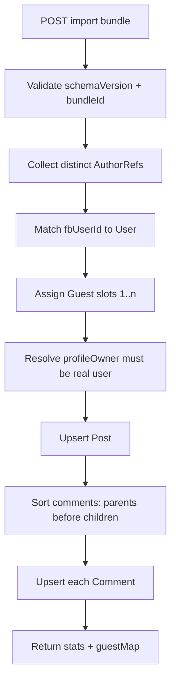

# SML Import Bundle — Specification

**Status:** Planned — not implemented.

Import a versioned **export bundle** (post + comment thread) into SML. Authors with a matching SML user (by `fbUserId`) map to real accounts; everyone else becomes **`Guest (1)` … `Guest (n)`** in stable, idempotent order.

**Related:** [FB_EXPORT_REPLICATION.md](FB_EXPORT_REPLICATION.md) (export + feasibility) · [README.md](README.md)

---

## API

| Method | Path | Auth | Behavior |
|---|---|---|---|
| `POST` | `/api/import/bundle` | Session | Import bundle onto **caller’s wall** (or explicit `profileOwnerFbUserId` if admin) |
| `POST` | `/api/import/bundle/preview` | Session | Dry-run: counts, guest assignments, conflicts — no writes |

**Request body:** raw JSON bundle (see schema below) or `{ "bundle": { … } }`.

**Response (success):**

```json
{
  "ok": true,
  "bundleId": "550e8400-e29b-41d4-a716-446655440000",
  "postId": "sml-uuid-…",
  "stats": {
    "usersMatched": 2,
    "guestsCreated": 3,
    "commentsImported": 14,
    "commentsUpdated": 0
  },
  "guestMap": [
    { "slot": 1, "displayName": "Guest (1)", "userId": "…", "sourceKeys": ["fb:999…"] }
  ]
}
```

---

## Bundle schema (version 1)

```typescript
/** Top-level envelope — required */
type ImportBundleV1 = {
  /** Must be 1 for this spec */
  schemaVersion: 1;
  /** Stable id for idempotent re-import; same bundleId → upsert, not duplicate */
  bundleId: string; // UUID
  exportedAt: string; // ISO-8601
  /** Optional provenance */
  source?: "sml_export" | "fb_page_api" | "manual" | "merge";
  /** Wall owner on target instance */
  profileOwner: AuthorRef;
  post: ImportPostV1;
};

type AuthorRef = {
  /** Preferred match key */
  fbUserId?: string | null;
  /** Fallback when no fbUserId (export-side label only; does not create SML user by name alone) */
  displayName?: string | null;
  /** Export-side stable anon key when fbUserId unknown — keeps Guest (n) stable across re-import */
  externalAuthorKey?: string | null;
};

type ImportPostV1 = {
  /** Upsert key when present */
  fbPostId?: string | null;
  /** Upsert key when fbPostId absent */
  smlPostId?: string | null;
  type: "TEXT" | "PHOTO" | "VIDEO_LINK";
  text?: string | null;
  photoCaption?: string | null;
  videoUrl?: string | null;
  linkTitle?: string | null;
  linkDescription?: string | null;
  /** Original timestamps preserved on import */
  createdAt?: string | null;
  author: AuthorRef;
  /** Flat list — importer builds tree via parentFbCommentId / parentSmlCommentId */
  comments: ImportCommentV1[];
};

type ImportCommentV1 = {
  fbCommentId?: string | null;
  smlCommentId?: string | null;
  author: AuthorRef;
  text: string;
  createdAt?: string | null;
  parentFbCommentId?: string | null;
  parentSmlCommentId?: string | null;
};
```

### Example bundle

```json
{
  "schemaVersion": 1,
  "bundleId": "550e8400-e29b-41d4-a716-446655440000",
  "exportedAt": "2026-05-25T18:00:00Z",
  "source": "merge",
  "profileOwner": { "fbUserId": "102111222333444" },
  "post": {
    "fbPostId": "123456789_987654321",
    "type": "VIDEO_LINK",
    "videoUrl": "https://example.com/review",
    "linkTitle": "Product review",
    "text": "Worth a deeper discussion.",
    "createdAt": "2026-05-20T10:00:00Z",
    "author": { "fbUserId": "102111222333444" },
    "comments": [
      {
        "fbCommentId": "178001",
        "author": { "fbUserId": "102555666777888" },
        "text": "Loved X and Y",
        "createdAt": "2026-05-20T11:00:00Z",
        "parentFbCommentId": null
      },
      {
        "fbCommentId": "178002",
        "author": { "externalAuthorKey": "fb-anon:page-scrape:abc" },
        "text": "What about Z?",
        "createdAt": "2026-05-20T11:05:00Z",
        "parentFbCommentId": "178001"
      },
      {
        "fbCommentId": "178003",
        "author": {},
        "text": "Unknown commenter with no keys",
        "createdAt": "2026-05-20T11:10:00Z",
        "parentFbCommentId": null
      }
    ]
  }
}
```

---

## Author resolution

### Step 1 — Match SML user (real account)

For each distinct `AuthorRef` in the bundle (post author, profile owner, every comment author):

1. If `fbUserId` is non-empty → `User.findUnique({ where: { fbUserId } })`
2. If found → use that user’s SML `id`

**Matched users** keep their real `displayName`, `username`, and `profilePicUrl`.

### Step 2 — Assign Guest (1…n)

Any author **not** matched in step 1 becomes a guest.

**Guest display name:** `Guest (1)`, `Guest (2)`, … `Guest (n)` where **n** is the count of distinct unmatched author identities in this bundle.

**Stable identity key** (for slot assignment — process authors in deterministic order):

```
authorKey =
  fbUserId
  ?? externalAuthorKey
  ?? `anon:${sha256(displayName ?? "")}:${firstCommentFbOrSmlId}`
```

**Ordering:** Sort unique unmatched `authorKey` lexicographically → assign slots `1..n`.

| authorKey order | displayName | username (stored) |
|---|---|---|
| 1st unmatched | Guest (1) | `guest_{bundleId}_1` |
| 2nd unmatched | Guest (2) | `guest_{bundleId}_2` |
| k-th unmatched | Guest (k) | `guest_{bundleId}_k` |

- **`bundleId`** is from the envelope (UUID, no hyphens in username slug optional).
- **`fbUserId`:** `null` for guests
- **`email`:** `null`
- **`profilePicUrl`:** `null` (default avatar stub in UI)

**Re-import idempotency:** Same `bundleId` + same slot → upsert same `guest_{bundleId}_k` user; display name stays `Guest (k)`.

### Step 3 — Profile owner

- Importer must resolve `profileOwner` to a real SML user (matched by `fbUserId`) **or** reject bundle unless caller is importing onto their own wall.
- **Guests cannot own walls.** If `profileOwner` would be a guest → `400` error.
- Default: caller must be the matched profile owner, or have admin flag (future).

---

## Guest rules (summary)

| Rule | Detail |
|---|---|
| Who becomes a guest | Any author without a matching SML `User` by `fbUserId` |
| Label | `Guest (1)` … `Guest (n)` — **not** FB display names |
| Slot stability | Same bundle + same `authorKey` → same slot on re-import |
| Cross-bundle | Guest (1) in bundle A ≠ Guest (1) in bundle B (different `bundleId` in username) |
| Login | Guests **cannot** log in; import-only synthetic users |
| Friendship | No auto-friendship for guests |

---

## Import algorithm



### Post upsert

| Condition | Upsert key |
|---|---|
| `fbPostId` present | `Post.fbPostId` (unique) |
| else `smlPostId` present | `Post.id` |
| else | create new; store `importBundleId` metadata (optional column) |

Set:

- `profileOwnerId` = resolved owner SML id
- `authorId` = resolved post author (real or guest)
- Preserve `createdAt` when provided (use `createdAt` from bundle, not `now()`)

### Comment upsert

| Condition | Upsert key |
|---|---|
| `fbCommentId` present | `Comment.fbCommentId` (unique) |
| else `smlCommentId` present | `Comment.id` |

**Tree order:** Import top-level comments first, then replies (topological sort by `parentFbCommentId` / `parentSmlCommentId`). Maintain internal `parentId` map:

```
fbCommentId → sml Comment.id   (during import)
```

Set `authorId` from resolved author (real or guest).

### Idempotent re-import

Same `bundleId` + same entity keys → **update** text/timestamps/authors where changed; do **not** duplicate posts/comments/guest users.

Optional: `ImportBundleRecord` table `{ bundleId, postId, importedAt, importedByUserId }` for audit.

---

## Schema additions (required for import)

```prisma
model User {
  fbUserId     String?  @unique
  /// import-only synthetic author; username guest_{bundleId}_{slot}
  isImportGuest Boolean @default(false)
}

model Post {
  fbPostId       String? @unique
  importBundleId String? // last bundle that touched this post
}

model Comment {
  fbCommentId    String? @unique
}
```

---

## Validation errors

| Code | When |
|---|---|
| `400` | Invalid schema / unsupported `schemaVersion` |
| `400` | `profileOwner` unresolved or would be guest |
| `403` | Caller not profile owner |
| `409` | `fbPostId` exists on another owner’s wall |
| `422` | Comment parent reference missing in bundle |

---

## Export side requirements (mirror spec)

Export must emit bundles compatible with this import spec:

- Always include `schemaVersion`, `bundleId`, `profileOwner.fbUserId`
- Every comment `author` should include **`fbUserId` and/or `externalAuthorKey`** so guest slots stay stable
- Include `fbPostId` / `fbCommentId` when known
- Flat `comments[]` with parent pointers (not nested tree required)

See [FB_EXPORT_REPLICATION.md](FB_EXPORT_REPLICATION.md) for export API plan.

---

## UI (optional)

- Profile owner: **Import bundle** (paste JSON / upload file) → preview guest map → confirm
- Post header badge: **Imported** + link to source `fbPostId` if set
- Comment author renders **Guest (3)** with muted styling (no profile link)

---

## Tests (acceptance)

1. Bundle with 2 matched `fbUserId` + 3 unmatched authors → exactly **Guest (1..3)**, stable on re-import
2. Re-import same `bundleId` → zero duplicate posts/comments/users
3. Comment thread order preserved (parent before reply)
4. Guest usernames unique per slot: `guest_{bundleId}_1`
5. Bundle with guest as `profileOwner` → `400`

---

## Files to implement

| Area | Files |
|---|---|
| Shared | `ImportBundleV1` Zod schema in `packages/shared/src/index.ts` |
| API | `services/importBundle.ts`, `routes/import.ts` |
| DB | migration for `fbPostId`, `fbCommentId`, `isImportGuest` |
| Web | optional import modal on own profile |
| Tests | `api.integration.test.ts` guest slot cases |
