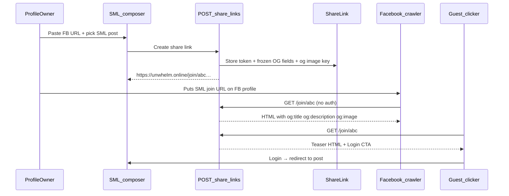

# FB → SML Share Link — Architecture

**Status:** Planned — not implemented.

Create a **public SML URL** from a Facebook post link on your profile, with **server-rendered Open Graph metadata** so Facebook’s crawler can preview the link **without authentication**. Humans who click through sign in to join the discussion on SocialMediaLite.

**Related:** [linkPreview.ts](../apps/api/src/services/linkPreview.ts) (inbound URL unfurling) · [PUSH_TO_FB.md](PUSH_TO_FB.md) (outbound to Facebook) · [README.md](README.md) · [AI_ADD_KNOWLEDGE.md](AI_ADD_KNOWLEDGE.md) · [FRIEND_SELECT_CHAT.md](FRIEND_SELECT_CHAT.md)

---

## Problem

Today SML is a **client-rendered SPA** ([`apps/web/index.html`](../apps/web/index.html) has no per-page OG tags). Profile and post APIs require a **session** ([`users.ts`](../apps/api/src/routes/users.ts), [`posts.ts`](../apps/api/src/routes/posts.ts)). Facebook’s share crawler:

- Does **not** run your React app meaningfully
- Cannot call `/api/...` without cookies
- Needs **HTML with `og:*` meta tags** on first response

So a link like `https://unwhelm.online/@user` is a poor Facebook preview. We need a **dedicated public HTML endpoint** with frozen metadata.

---

## Goals

1. User pastes a **Facebook post URL** (from their FB profile/timeline) and picks the **SML post** it continues.
2. SML generates a stable link, e.g. `https://unwhelm.online/join/{token}`.
3. That URL returns **public HTML** including:
   - **Title / description** with default line: *"Join the deeper discussion on SocialMediaLite"*
   - **`og:image`** on a **publicly accessible** URL (no auth)
   - Canonical URL, site name, Twitter card tags
4. User puts the **SML join link** on their Facebook profile or in an FB post — FB scrapes `/join/{token}` successfully.
5. Clicking the link: teaser page + **Log in to join** → redirect to the SML post after auth.

---

## Non-goals (v1)

- Syncing comments bidirectionally with Facebook
- Letting non-friends read full post body without login (teaser only on public page)
- Scraping Facebook reliably for auto-fill (often blocked; optional best-effort)

---

## User flow



---

## Public HTML endpoint (core)

**Route:** `GET /join/:token` — served by **Express**, not the SPA.

**Auth:** None. Token is the capability (unguessable).

**Response:** `text/html` document (~2–4 KB) containing:

```html
<!DOCTYPE html>
<html lang="en">
<head>
  <meta charset="utf-8" />
  <title>Join the deeper discussion on SocialMediaLite</title>
  <meta name="description" content="…teaser…" />

  <meta property="og:type" content="website" />
  <meta property="og:site_name" content="SocialMediaLite" />
  <meta property="og:url" content="https://unwhelm.online/join/{token}" />
  <meta property="og:title" content="…" />
  <meta property="og:description" content="Join the deeper discussion on SocialMediaLite. …" />
  <meta property="og:image" content="https://unwhelm.online/assets/…/hero.webp" />
  <meta property="og:image:width" content="476" />
  <meta property="og:image:height" content="248" />

  <meta name="twitter:card" content="summary_large_image" />
  <meta name="twitter:title" content="…" />
  <meta name="twitter:description" content="…" />
  <meta name="twitter:image" content="…" />

  <link rel="canonical" href="https://unwhelm.online/join/{token}" />
</head>
<body>
  <h1>Join the deeper discussion on SocialMediaLite</h1>
  <p>…teaser…</p>
  <p><a href="/login?next=%2F{username}%23post-{postId}">Log in to continue</a></p>
</body>
</html>
```

**Why metadata is “in the link” (frozen at create time):** OG fields are **stored on `ShareLink`** when the owner creates the link. Facebook never needs to hit authenticated JSON APIs — one crawl of `/join/{token}` is enough. Image URL must point at existing public `/assets/...` storage (same as link preview heroes).

**Default copy:**

| Field | Default |
|---|---|
| `og:description` prefix | `Join the deeper discussion on SocialMediaLite.` |
| `og:title` | `{post.linkTitle \|\| post excerpt \|\| displayName}'s discussion` |
| `og:image` | Post `linkPreviewImageKey` → else profile banner → else branded default SVG/PNG |

Owner can override title/description in the create dialog; image falls back as above.

---

## Data model

```prisma
model ShareLink {
  id              String   @id @default(uuid())
  token           String   @unique // URL-safe, e.g. nanoid 12–16 chars
  profileOwnerId  String
  postId          String
  createdByUserId String
  fbSourceUrl     String?  // pasted Facebook URL (reference only)

  /// Frozen OG payload — what FB crawlers see
  ogTitle         String
  ogDescription   String
  ogImageKey      String?  // storage key; served via /assets/…

  revokedAt       DateTime?
  createdAt       DateTime @default(now())
  updatedAt       DateTime @updatedAt

  profileOwner User @relation(...)
  post         Post @relation(...)
  @@index([profileOwnerId])
}
```

- **`token`**: unguessable; rotatable by revoke + recreate.
- **`og* fields`**: snapshot at creation; edit updates snapshot (optional v1b).
- **`fbSourceUrl`**: audit / UI “Originally shared on Facebook”; not exposed in OG unless owner opts in.

---

## API (authenticated)

New router `apps/api/src/routes/shareLinks.ts`:

| Method | Path | Auth | Behavior |
|---|---|---|---|
| `POST` | `/api/posts/:postId/share-link` | Session | Create link; body `{ fbSourceUrl?, ogTitle?, ogDescription? }` |
| `GET` | `/api/me/share-links` | Session | List own links |
| `DELETE` | `/api/me/share-links/:id` | Session | Revoke (public URL → 410 or generic gone page) |

**Create guards:**

1. `post.authorId === session.userId` and `post.profileOwnerId === session.userId` (own post on own wall), **or** allow any post on own wall you can moderate — match **AI Add** policy.
2. Build default `ogTitle` / `ogDescription` from post + owner display name.
3. Resolve `ogImageKey` from post preview image; copy to `share-links/{token}/og.webp` if we want immutability when post edits (optional v1: reference live key).
4. Return `{ shareLink: { url, token, ogTitle, ogDescription, ogImageUrl } }`.

**Public (no auth):**

| Method | Path | Behavior |
|---|---|---|
| `GET` | `/join/:token` | HTML teaser + OG tags; 404 if missing/revoked |

Mount **`GET /join/:token`** on Express **before** SPA — see nginx below.

---

## Nginx / routing

Add **before** `location / { try_files … index.html }` in [`deploy/nginx/unwhelm.online.conf`](../deploy/nginx/unwhelm.online.conf):

```nginx
location /join/ {
    proxy_pass http://127.0.0.1:3001;
    proxy_http_version 1.1;
    proxy_set_header Host $host;
    proxy_set_header X-Real-IP $remote_addr;
    proxy_set_header X-Forwarded-For $proxy_add_x_forwarded_for;
    proxy_set_header X-Forwarded-Proto $scheme;
}
```

Dev: Vite proxy `/join` → API (add to `vite.config.ts`).

---

## Web UI

On own profile, per post (PostCard actions):

- **Create FB share link** — modal:
  - Paste **Facebook URL** (optional)
  - Preview/edits: title, description
  - Preview card mimicking FB share
  - Copy button: `https://{host}/join/{token}`
- List existing share links in post menu or profile settings (revoke)

After login redirect: `/{username}#post-{postId}` — add hash scroll highlight on [`ProfilePage`](../apps/web/src/pages/ProfilePage.tsx) (small follow-up).

---

## Facebook crawler notes

- Use **absolute HTTPS URLs** for `og:image` and `og:url`.
- Image: **≥ 200×200**; reuse **476×248** link-preview size (already stored).
- Avoid cookies / redirects to `/login` for `GET /join/:token` when `User-Agent` looks like a bot — same HTML for everyone; body CTA is enough.
- Optional: [`facebookexternalhit`](https://developers.facebook.com/docs/sharing/webmasters) logging for debug.
- Validate with [Facebook Sharing Debugger](https://developers.facebook.com/tools/debug/) after deploy.

**Inbound FB scrape (optional):** Best-effort `linkPreview` on pasted `fbSourceUrl` to pre-fill title — expect failures; manual edit always available.

---

## Security & privacy

| Risk | Mitigation |
|---|---|
| Token enumeration | Long random token; rate-limit `/join/*` |
| Leaking private posts | Public HTML shows **teaser only** (title, generic description, image); full body after login + friend check |
| Revoked links | `410 Gone` or neutral “Link expired” HTML without OG |
| SSRF via FB URL paste | Reuse [`assertOutboundUrlSafe`](../apps/api/src/services/linkPreview.ts) on optional fetch |

---

## Implementation phases

### Phase 1a — public join page

- `ShareLink` model + migration
- `GET /join/:token` HTML renderer (`shareLinkPage.ts`)
- `POST /api/posts/:postId/share-link` + guards
- Default branded OG image asset
- Nginx + Vite proxy
- PostCard “Create share link” + copy URL

### Phase 1b — polish

- List/revoke share links
- FB Sharing Debugger checklist in deploy docs
- `#post-{id}` scroll on profile
- Optional: immutable OG image copy on create

### Phase 2 (optional)

- Analytics: crawl vs click counts
- QR code export
- Locale-specific OG description

---

## Files to touch

| Area | Files |
|---|---|
| DB | `packages/db/prisma/schema.prisma`, migration |
| API | `services/shareLinkPage.ts`, `routes/shareLinks.ts`, [`app.ts`](../apps/api/src/app.ts) |
| Shared | Zod schemas for create payload |
| Web | `ProfilePage.tsx` / PostCard modal, copy UX |
| Deploy | [`deploy/nginx/unwhelm.online.conf`](../deploy/nginx/unwhelm.online.conf), `vite.config.ts` |
| Docs | This file, [README.md](README.md) |
| Tests | Integration: public GET returns og:title; create requires auth; revoked → 410 |

---

## Push to Facebook (companion feature)

After a share link exists, **Push to FB** publishes the SML post to Facebook using that join URL — see [PUSH_TO_FB.md](PUSH_TO_FB.md).

- **v1:** Share Dialog / sharer URL (user confirms on Facebook; works for personal profile)
- **v2:** Graph API post to a connected **Facebook Page** (requires App Review)

Implement **share link first**, then push (push depends on `/join/{token}` for link previews).

---

## Example OG payload (frozen)

**Input:** FB post `https://www.facebook.com/.../posts/123` + SML VIDEO_LINK post “Product review roundup”

**Output URL:** `https://unwhelm.online/join/V1StGXR8_Z5j`

**Facebook sees:**

- **Title:** Product review roundup — Edmundo on SocialMediaLite  
- **Description:** Join the deeper discussion on SocialMediaLite. Friends are debating X, Y, and Z in the comments.  
- **Image:** `https://unwhelm.online/assets/users/…/link-preview-….webp`
