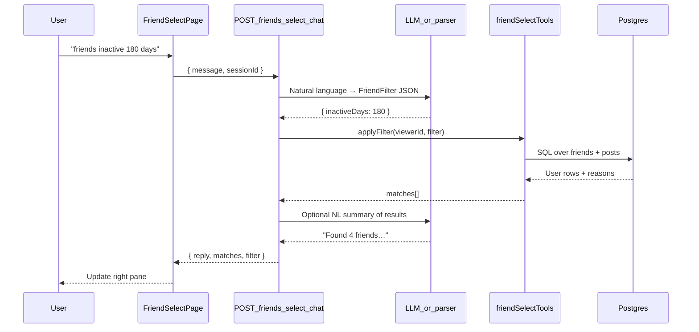
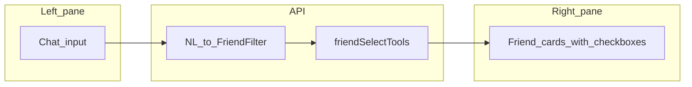

# Friend Select Chat — Architecture

**Status:** Planned — not implemented. See [README.md](README.md) for doc index and suggested build order.

Interactive split-pane UI to describe friends in natural language (left) and see matching friends update live (right). Examples: *"friends on the west coast who like jazz"*, *"friends who haven't posted in 180 days"*.

**Related:** [AI_ADD_KNOWLEDGE.md](AI_ADD_KNOWLEDGE.md) (same hybrid LLM + tools pattern, separate feature).
## Goals

- **Left pane:** conversational filter descriptions (multi-turn OK — refine with follow-ups).
- **Right pane:** live list of matching **accepted friends** with avatar, name, and why they matched.
- **Selection:** checkboxes to build a friend set for a future action (share audience, group, export list — action TBD in v1).

## Constraints

| Decision | Choice |
|---|---|
| LLM | Same as AI Add — **Ollama** (cheapest), optional skip |
| Friend pool | **Accepted friends only** (from `Friendship`) |
| Query style | **Hybrid** — LLM parses intent → **SQL/tools** execute filters (same pattern as profile chatbot) |

---

## Current data reality

Today `User` has: `displayName`, `username`, `email`, `profilePicUrl`, timestamps. **No location, interests, or bio.**

| Example query | Works today? | How |
|---|---|---|
| "Friends who haven't posted in 180 days" | **Yes** | SQL: last `Post` on friend's own wall (`profileOwnerId = authorId`) |
| "Friends who posted this month" | **Yes** | Same, inverted |
| "Friends who commented on my wall recently" | **Yes** | SQL on `Comment` + your posts |
| "Friends named Bob" | **Yes** | `displayName` / `username` ILIKE |
| "West coast" | **No** (yet) | Needs `User.location` or similar |
| "Like jazz" | **Partial** | Keyword search in friend's **post text** on their wall, or `User.interests` when added |

v1 ships structural filters; v1b adds profile fields + content keyword search for interest/location-style queries.

---

## UI layout

New route: `/friends/select` (or tab on [`FriendsPage`](apps/web/src/pages/FriendsPage.tsx)).

```
┌─────────────────────────────┬─────────────────────────────┐
│  Describe friends…          │  Matching friends (12)        │
│  ┌─────────────────────┐    │  ☑ @alice  — inactive 200d  │
│  │ Chat messages       │    │  ☐ @bob    — inactive 190d  │
│  │ You: west coast jazz│    │  ☐ @carol  — jazz in posts  │
│  │ Bot: 3 match…       │    │  …                          │
│  └─────────────────────┘    │  [Select all] [Clear]       │
│  [ input………………… ] [Send]    │  Selected: 1                │
└─────────────────────────────┴─────────────────────────────┘
```

- **Left:** chat transcript + input; each send re-runs filter (or merges with prior filter — see session below).
- **Right:** scrollable friend cards; checkbox per row; optional one-line **match reason** from tool metadata.
- **Mobile:** stacked panes (chat top, results bottom) or tab toggle.

---

## Architecture





---

## FriendFilter schema

Structured object the LLM (or heuristic parser) produces; **tools only trust this**, not free-form text.

```typescript
type FriendFilter = {
  /** No post on own wall in N days */
  inactiveDays?: number;
  /** Must have posted on own wall since date */
  activeSince?: string; // ISO date
  /** displayName or username contains */
  nameContains?: string;
  /** Friend commented on viewer's wall within N days */
  commentedOnMyWallWithinDays?: number;
  /** Keywords searched in friend's own-wall post text (TEXT + captions + link titles) */
  postTextContainsAny?: string[];
  /** Requires User.location — Phase 1b */
  locationContains?: string;
  /** Requires User.interests — Phase 1b */
  interestsContainAny?: string[];
};
```

Multiple fields = **AND**. LLM job: map *"west coast jazz inactive"* → `{ locationContains: "west coast", postTextContainsAny: ["jazz"], inactiveDays?: undefined }`.

---

## friendSelectTools (deterministic)

New `apps/api/src/services/friendSelectTools.ts`:

| Function | Logic |
|---|---|
| `listAcceptedFriends(viewerId)` | Base set from `Friendship` status `ACCEPTED` |
| `applyFilter(viewerId, filter)` | Intersect base set with each constraint |
| `lastOwnWallPostAt(userId)` | `MAX(Post.createdAt)` where `profileOwnerId = authorId = userId` |
| `postsMatchingKeywords(userId, keywords[])` | ILIKE on `text`, `photoCaption`, `linkTitle` for own-wall posts |

Return shape:

```typescript
type FriendMatch = {
  user: PublicUser;
  reasons: string[]; // e.g. ["No post in 214 days", "Post mentions jazz"]
};
```

---

## API

New routes on [`apps/api/src/routes/friends.ts`](apps/api/src/routes/friends.ts) or `friendSelect.ts`:

| Method | Path | Behavior |
|---|---|---|
| `POST` | `/api/friends/select-chat` | `{ message, sessionId? }` → `{ reply, filter, matches }` |
| `GET` | `/api/friends/select-sessions/:id` | Optional: restore last filter + matches |

**Session:** `FriendSelectSession` in memory or DB — stores cumulative filter state so *"also exclude bob"* can merge. v1 can **replace** filter each message (simpler); v2 merges.

**Auth:** `requireAuth`; only search **your** accepted friends.

---

## LLM role

| Task | Who |
|---|---|
| NL → `FriendFilter` JSON | Ollama with strict JSON schema prompt |
| Explain results in chat | Ollama (optional; can use template: "Found N friends matching …") |
| Who matched | **SQL only** — never let LLM invent the list |

If Ollama down: fallback heuristic parser for common patterns (`(\d+) days`, `"inactive"`, usernames).

---

## Schema extensions (Phase 1b)

Optional profile fields for location/interest queries without scraping posts:

```prisma
model User {
  // existing fields…
  location   String?  // e.g. "Seattle, WA" or "West Coast"
  interests  String?  // comma-separated or JSON array: "jazz, hiking"
  bio        String?
}
```

Edit-profile UI later; until then, west-coast/jazz queries use `postTextContainsAny` or return: *"Location not set for most friends — try keyword search or add profile fields."*

---

## Example queries mapped

| User says | Filter | Notes |
|---|---|---|
| "Friends that haven't posted in 180 days" | `{ inactiveDays: 180 }` | Fully structural |
| "Friends who posted this week" | `{ activeSince: "<7d ago ISO>" }` | Structural |
| "Friends who like jazz" | `{ postTextContainsAny: ["jazz"] }` | Content search; false positives possible |
| "West coast friends who like jazz" | `{ locationContains: "west", postTextContainsAny: ["jazz"] }` | Location needs profile field or bio |
| "Friends who commented on my posts lately" | `{ commentedOnMyWallWithinDays: 30 }` | Structural |

---

## Selection output (v1)

Right pane checkboxes maintain client-side `selectedUserIds: Set<string>`.

Future hooks (not v1):

- Save as **FriendGroup** (name + member ids)
- Use as audience when sharing a post
- Export CSV

---

## Implementation phases

### Phase 1a — structural filters

- `FriendFilter` type + `friendSelectTools.ts`
- `POST /api/friends/select-chat` with LLM JSON parse (or heuristics)
- Split-pane page + friend cards + checkboxes
- Filters: `inactiveDays`, `activeSince`, `nameContains`, `commentedOnMyWallWithinDays`

### Phase 1b — content + profile

- `postTextContainsAny` keyword search
- Optional `User.location`, `User.interests` migration + edit profile
- Match reasons on cards

### Phase 1c — session merge

- Multi-turn refine: *"now only west coast"* merges filters
- `FriendSelectSession` persistence

---

## Files to touch

| Area | Files |
|---|---|
| API | `services/friendSelectTools.ts`, `services/llmClient.ts` (reuse), extend `routes/friends.ts` |
| Shared | `FriendFilter` Zod schema in `packages/shared/src/index.ts` |
| Web | `apps/web/src/pages/FriendSelectPage.tsx`, router entry, link from `FriendsPage` |
| DB | Optional Phase 1b: `User.location`, `User.interests` migration |
| Config | Reuse `OLLAMA_URL` / `OLLAMA_MODEL` from AI Add |
| Tests | Integration tests for inactive-days filter, auth boundary |

---

## Relation to AI Add / profile chatbot

Shares **`llmClient.ts`** and the **hybrid pattern** (LLM parses → tools execute facts). Separate feature, separate UI and tools — no dependency on `AiKnowledgeEntry`.

---

## Related documentation

- [README.md](README.md) — documentation index
- [AI_ADD_KNOWLEDGE.md](AI_ADD_KNOWLEDGE.md) — AI Add + profile chatbot (shares `llmClient.ts`)
- [FB_TO_SML_SHARE_LINK.md](FB_TO_SML_SHARE_LINK.md) — public join links for Facebook OG previews
- [PUSH_TO_FB.md](PUSH_TO_FB.md) — push SML posts to Facebook
- [PHASE1_GOALS.md](PHASE1_GOALS.md) — Phase 1 vs Phase 2 scope
