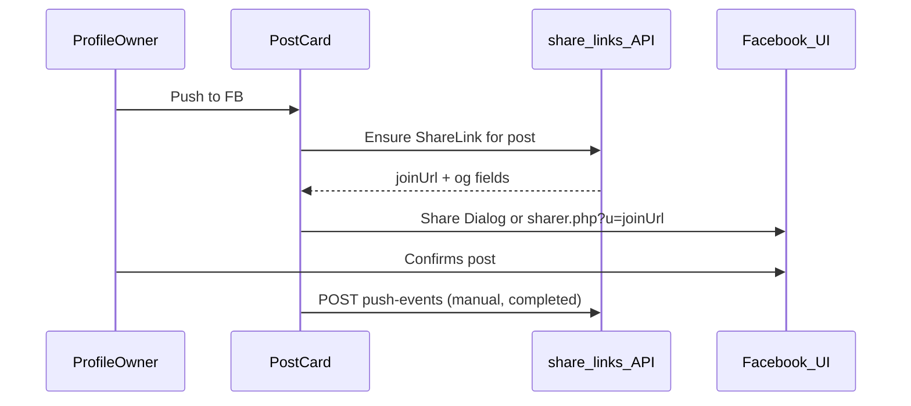
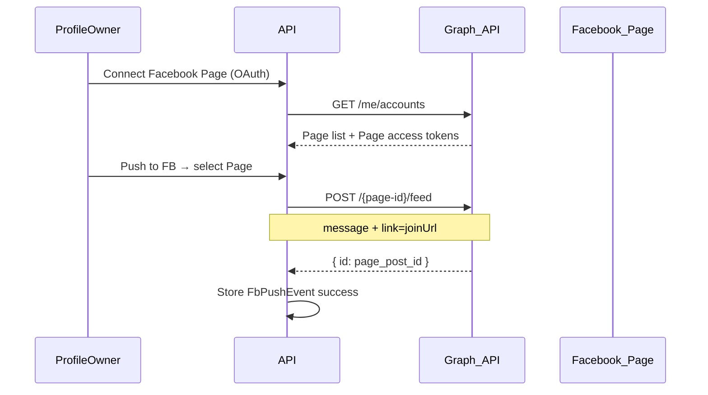

# Push to Facebook — Architecture

**Status:** Planned — not implemented.

Take an **SML post** and publish it to **Facebook** — with a link back to the deeper discussion on SocialMediaLite (via [FB → SML share link](FB_TO_SML_SHARE_LINK.md) `/join/{token}` OG metadata).

**Related:** [FACEBOOK_LOGIN_SETUP.md](FACEBOOK_LOGIN_SETUP.md) · [FB_TO_SML_SHARE_LINK.md](FB_TO_SML_SHARE_LINK.md) · [README.md](README.md)

---

## Meta API reality (important)

| Target | Server-side API push? | Notes |
|---|---|---|
| **Personal profile timeline** | **No** | `publish_actions` removed years ago; third-party apps cannot auto-post to a user’s personal feed |
| **Facebook Page** | **Yes** | [Pages API](https://developers.facebook.com/docs/pages-api/posts/) — `POST /{page-id}/feed` with Page access token + `pages_manage_posts` (App Review) |
| **User confirms in FB UI** | **Yes** | [Share Dialog](https://developers.facebook.com/docs/sharing/reference/share-dialog) or `facebook.com/sharer.php` — user clicks Post on Facebook |

**Product implication:** “Push to FB” ships as **two modes**:

1. **Share (v1)** — opens Facebook UI; user publishes manually (works for personal profile + Pages).
2. **Page publish (v2)** — true server push to a **Facebook Page** the user manages (optional, requires extra OAuth + review).

---

## Goals

- From an **own-wall post**, one action: **Push to FB**
- FB post includes:
  - Short **message** (from SML post text / caption / link title)
  - **Link** to `https://unwhelm.online/join/{token}` (public OG preview — see share-link doc)
  - Optional: “Join the deeper discussion on SocialMediaLite” in message template
- Record **push history** on SML (when, where, success/fail)
- Do **not** require friends to see SML content on FB — link is a teaser; discussion stays on SML after login

---

## Non-goals (v1)

- Auto-posting to personal timeline without user confirmation
- Syncing FB comments back into SML (separate future feature)
- Posting photos binary to FB (v2 Page could use `photos` edge; v1 link-share only)

---

## Recommended flow (v1 — Share)



### Steps

1. **`canPushToFb`** — same guard as AI Add / share link: own post on own wall.
2. **Ensure `ShareLink`** exists ([`FB_TO_SML_SHARE_LINK.md`](FB_TO_SML_SHARE_LINK.md)); create if missing.
3. Build **share message**:
   ```
   {post excerpt or linkTitle}

   Join the deeper discussion on SocialMediaLite:
   {joinUrl}
   ```
4. Open Facebook:
   - **Web:** `https://www.facebook.com/sharer/sharer.php?u={encodeURIComponent(joinUrl)}&quote={encodeURIComponent(message)}`  
     (`quote` support varies; message may be copy-paste fallback)
   - **Or:** FB SDK `FB.ui({ method: 'share', href: joinUrl, quote: message })` if SDK loaded
5. Optional modal: **Copy message** + **Open Facebook** buttons.
6. Log `FbPushEvent` with `method: 'share_dialog'`, `status: 'initiated'` (user may not complete).

---

## Page publish flow (v2 — server push)

For users who manage a **Facebook Page** (creator/business use case).



### Extra OAuth scopes (App Review required)

- `pages_show_list`
- `pages_manage_posts`
- `pages_read_engagement` (optional, verify post)

Login flow extension: after Facebook Login, **Connect Page** step stores encrypted Page tokens per user.

### Graph API call

```http
POST https://graph.facebook.com/v20.0/{page-id}/feed
Content-Type: application/json

{
  "message": "Join the deeper discussion on SocialMediaLite…",
  "link": "https://unwhelm.online/join/{token}",
  "published": true,
  "access_token": "{page_access_token}"
}
```

**Photo posts:** v2b — if SML post is PHOTO, use `/photos` with `url` pointing at public `photoUrl` (must be HTTPS and FB-accessible).

**Video/link posts:** `link` parameter + message; OG on join URL or direct link preview from join page.

---

## Data model

```prisma
model ShareLink {
  // … see FB_TO_SML_SHARE_LINK.md
}

/// Optional v2: connected Facebook Pages
model FacebookPageConnection {
  id              String   @id @default(uuid())
  userId          String
  fbPageId        String
  pageName        String
  /// Encrypted at rest in production
  pageAccessToken String
  tokenExpiresAt  DateTime?
  createdAt       DateTime @default(now())
  updatedAt       DateTime @updatedAt

  user User @relation(...)
  @@unique([userId, fbPageId])
}

model FbPushEvent {
  id              String   @id @default(uuid())
  postId          String
  shareLinkId     String?
  pushedByUserId  String
  method          String   // share_dialog | page_api
  fbPageId        String?  // set for page_api
  fbPostId        String?  // Graph API returned id
  status          String   // initiated | success | failed
  errorMessage    String?
  createdAt       DateTime @default(now())

  post      Post       @relation(...)
  shareLink ShareLink? @relation(...)
  user      User       @relation(...)
  @@index([postId, createdAt(sort: Desc)])
}
```

**Dependency:** `ShareLink` should exist before push (creates public OG target for `link` parameter).

---

## API routes

| Method | Path | Auth | Behavior |
|---|---|---|---|
| `POST` | `/api/posts/:postId/push-to-fb` | Session | v1: ensure ShareLink, return `{ joinUrl, message, sharerUrl }` |
| `POST` | `/api/posts/:postId/push-to-fb/page` | Session | v2: `{ pageId }` → Graph API publish |
| `GET` | `/api/me/facebook-pages` | Session | v2: list connected Pages |
| `POST` | `/api/me/facebook-pages/connect` | Session | v2: OAuth callback / token exchange |
| `DELETE` | `/api/me/facebook-pages/:id` | Session | v2: disconnect Page |
| `POST` | `/api/posts/:postId/push-to-fb/events` | Session | Optional: client reports share_dialog completed |

**Guards:** `post.authorId === session.userId && post.profileOwnerId === session.userId`

---

## Web UI

On `PostCard` (own posts):

| Control | v1 | v2 |
|---|---|---|
| **Push to FB** | Opens share modal → copy message + open sharer URL | Dropdown: Share manually **or** Publish to Page X |
| Status | “Share link ready” / last push time | “Published to My Page · 2h ago” with link to FB post |

Modal contents:

- Preview of message + join URL
- **Copy all**
- **Open Facebook to share**
- (v2) Page selector + **Publish now**

Show warning once: *Personal timeline posts must be confirmed in Facebook — SML cannot auto-post to your profile.*

---

## Content mapping (SML post → FB post)

| SML type | FB message source | FB link |
|---|---|---|
| TEXT | First ~400 chars of `text` | `/join/{token}` |
| PHOTO | `photoCaption` or `text` | `/join/{token}` |
| VIDEO_LINK | `text` + `linkTitle` | `/join/{token}` (not raw `videoUrl` — drives traffic to SML discussion) |

Template:

```
{excerpt}

Join the deeper discussion on SocialMediaLite.
```

Join URL carries OG image/title for FB link preview when `link` is set (Page API) or when user shares URL (Share Dialog).

---

## Security & compliance

- **Tokens:** Encrypt `pageAccessToken` at rest; never send to client.
- **Scopes:** Request minimum Page permissions; document in privacy policy.
- **App Review:** Page publish requires Meta approval — plan for dev-mode testing on test Pages only until live.
- **Rate limits:** Handle Graph API `#80001` with retry messaging.
- **User consent:** Explicit button per push; no background posting.

---

## Stub / offline mode

When Facebook env vars missing or stub login:

- **Push to FB** disabled with tooltip, or copies join URL only (no FB open).
- `FbPushEvent` still loggable in test harness with `method: 'stub'`.

---

## Implementation phases

### Phase 1 — Share dialog push (ship first)

- Reuse `ShareLink` create/ensure from [FB_TO_SML_SHARE_LINK.md](FB_TO_SML_SHARE_LINK.md)
- `POST /api/posts/:postId/push-to-fb` → `{ joinUrl, message, sharerUrl }`
- PostCard button + modal (copy + open Facebook)
- `FbPushEvent` log (`initiated`)
- Docs update to [FACEBOOK_LOGIN_SETUP.md](FACEBOOK_LOGIN_SETUP.md) — clarify share vs Page API

### Phase 2 — Facebook Page publish

- `FacebookPageConnection` model + connect flow
- Extended OAuth + token storage
- `POST .../push-to-fb/page`
- App Review checklist doc section
- Push history UI

### Phase 3 (optional)

- Schedule Page posts (`scheduled_publish_time`)
- Push PHOTO with uploaded image to Page
- Two-way link: store `fbPostId` on `ShareLink` for analytics

---

## Files to touch

| Area | Files |
|---|---|
| DB | `ShareLink`, `FbPushEvent`, (v2) `FacebookPageConnection` migrations |
| API | `services/facebookGraph.ts`, `routes/shareLinks.ts`, `routes/fbPush.ts`, extend `auth.ts` (v2 scopes) |
| Web | `ProfilePage.tsx` PostCard, push modal |
| Docs | This file, `FACEBOOK_LOGIN_SETUP.md`, `FB_TO_SML_SHARE_LINK.md` |
| Config | Optional `FACEBOOK_PAGE_PUBLISH_ENABLED=true` feature flag |
| Tests | Integration: push-to-fb returns sharerUrl; guards; stub mode |

---

## Example (v1 user experience)

1. You publish a VIDEO_LINK post on SML: “Great jazz club list for the west coast.”
2. Click **Push to FB**.
3. SML creates `/join/abc123` with OG title + preview image.
4. Modal shows message + **Open Facebook**.
5. Facebook share dialog opens with link; you add a line and post to **your profile**.
6. Friends see FB preview → click → SML login → comment thread.

---

## Example (v2 Page publish)

Same post → **Publish to “My Jazz Blog” Page** → server posts via Graph API → `fbPostId` stored → appears on Page feed without second confirmation step.
